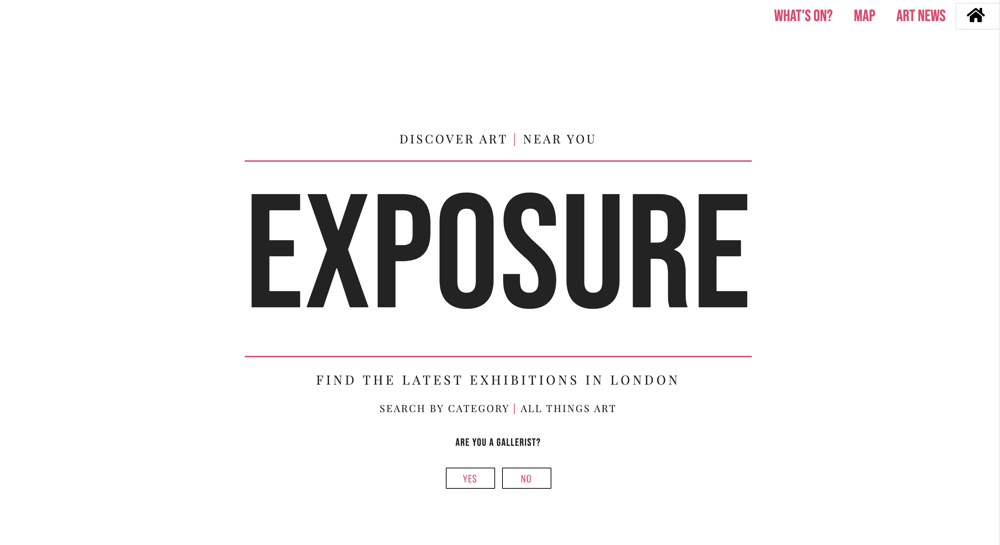
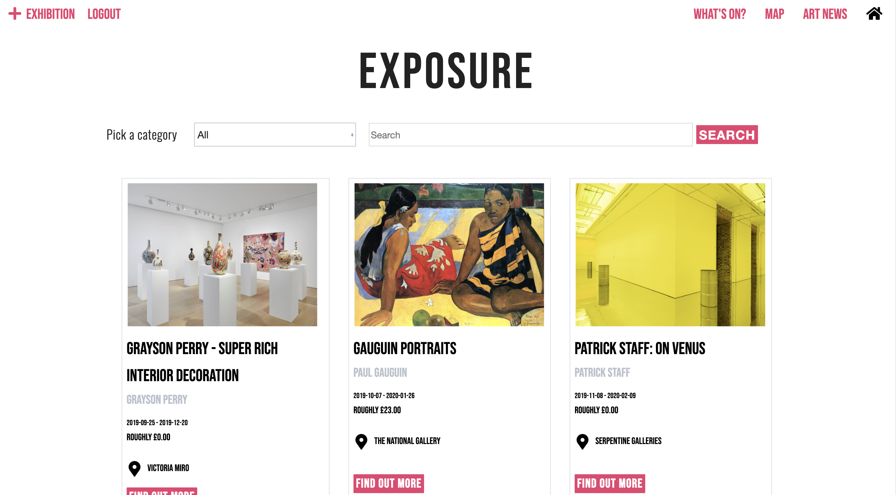
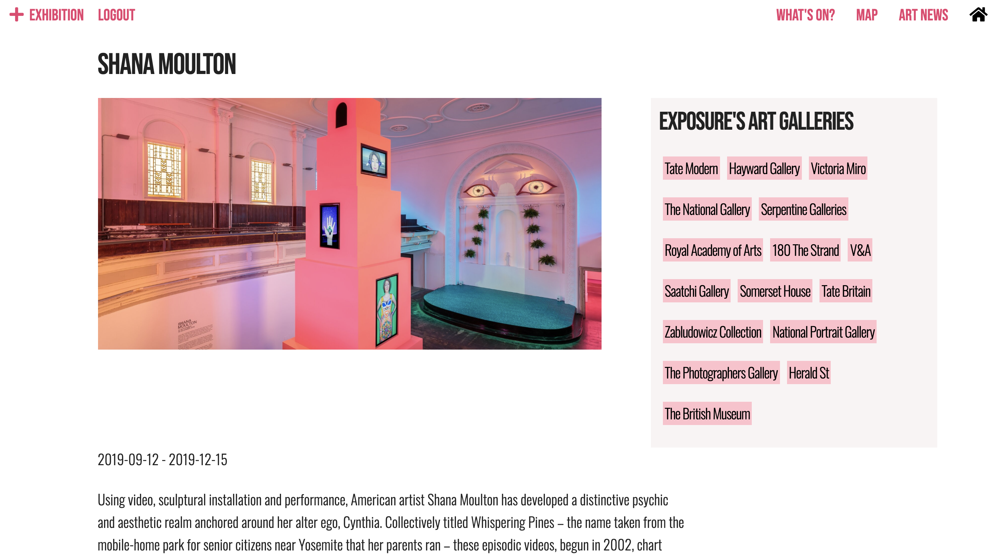
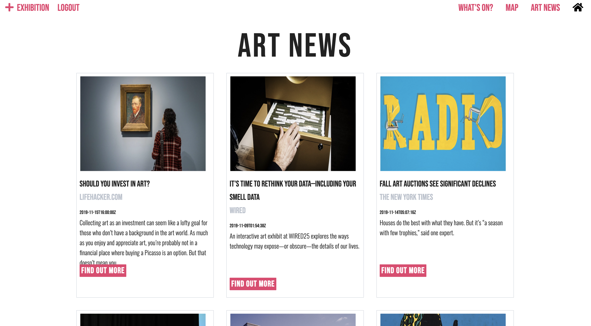
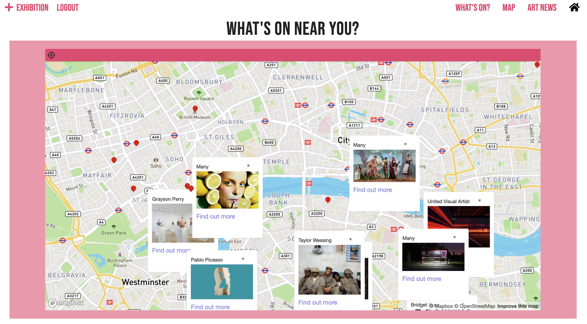
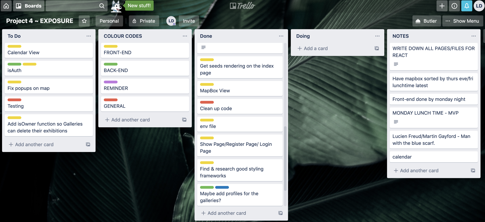
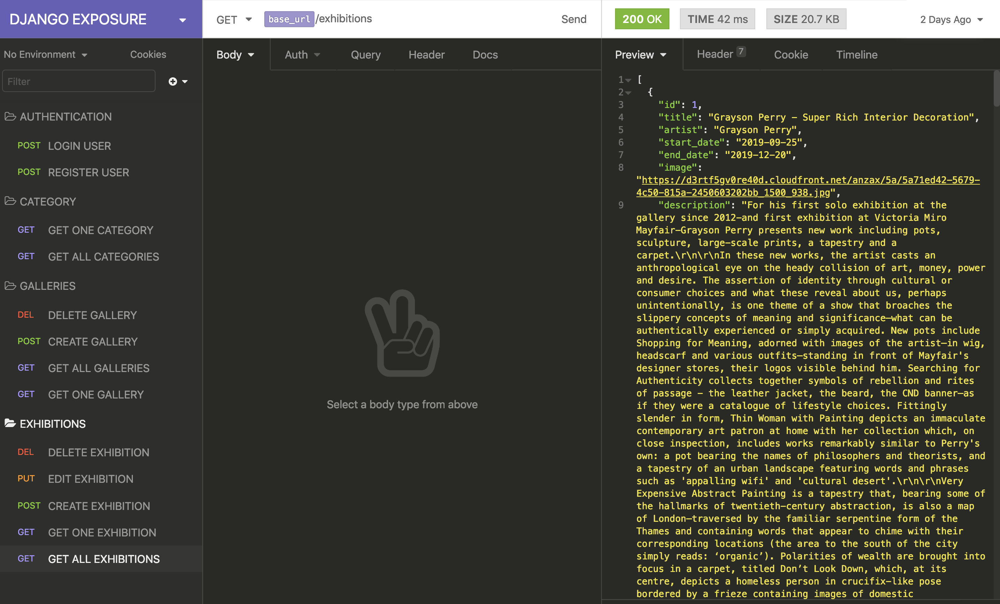

# EXPOSURE


#  Project #4: A Django + React App

# EXPOSURE

Aimed at art enthusiasts, Exposure is a full-stack React and Python web app that it allows users to browse upcoming art exhibitions in London.

## Brief

This was my final project at GA. We were given the option to either work in a group or individually. Following the third project which was group, I decided to do it individually so that I could use the opportunity as a means to test my own learning and showcase my abilities. Working individually with just one week I had to decide which features were core MVP and which ones I would have to cut for the deadline, and add further on down the line.

## Deployment

This web app is deployed on Heroku and it can be found here: https://exposure-to-art.herokuapp.com

## Built With

1. HTML5
2. SCSS, Spectre & Skeleton
3. Javascript
   * ECMAScript6
   * React.js
4. Python
   * Django
5. mySQL
   * PostgreSQL
6. GitHub


## Set Up 

After cloning the repo to your local machine, you can run the app with these commands:

```
<!-- to install JavaScript Packages: -->
$ yarn
<!-- to install Python packages: -->
$ pipenv install django
<!-- to install Python packages: -->
$ createdb project-04
<!--Then to seed the database: -->
$ python manage.py loaddata exhibitions/seeds.json
<!-- Run the frontend in your localhost: -->
$ yarn serve:front
<!-- Run the backend in your localhost: -->
$ yarn serve:back
```


## User Experience

The user does not have to be logged in to browse the website for exhibitions. When the user lands on the homepage, they are asked if they are a gallerist.



If they aren't a gallerist thye are redirected to the index page to browse the exhibitions.



If they are a gallerist they they are redirected to the register page.


If they already have an account they click on the link and are redirected to the login page. 


Once they are logged in they land on the index page to browse the exhibitions, just like a user who isnt logged in. The only difference is that they are given the option in the top left hand corner of the navbar to add an exhibition as well as logout.

The user can refine their seach for exhibitions by typing in artists in the nav bar aswell as filter by category in the dropdown menu.  When they click on a card it takes them to the show page to find out more about an exhibition. 



At the bottom of the show page are category buzzwords which the user can click on. This will take them to a page with all the exhibitions that match that category. Similarly there is box of all the galleries.

I built my own API for the exhibitions but also wanted to use a third party API. I decided to use the News API to get art related news as well as mapbox. Mapbox enabled me to mark all the exhibitions on a map and I even added geo location. 

News


Map



## Planning

In order to plan my backend models I drew a relationship diagram and I also did some rough wireframes as to how I wanted my product to look.


I learnt from previous projects the importance of planning therefore used Trello to organise and set myself daily goals.



I also used Insomnia to organise my back-end as I preferred it to the Django admin rest framework.




## Challenges

This was the first time I used Python and Django.


Mapbox

```  populateMap() {
    this.state.exhibitions.map(exhib => {
      axios.get(`https://api.mapbox.com/geocoding/v5/mapbox.places/${exhib.postcode.replace(' ','')}.json?access_token=${process.env.MAPBOX_ACCESS_TOKEN}`)
        .then(res => {
          console.log(res, 'the res')
          const long = res.data.features[0].geometry.coordinates[0]
          const lat = res.data.features[0].geometry.coordinates[1]
          const _id = exhib._id
          console.log(exhib.postcode)
          this.setState({ exhibPins: [...this.state.exhibPins, { _id, long, lat }] })
        })
        .catch(err => console.log(err))
    })
  }
```

  
  
  In the back-end I had to add my own abstract user model as I needed to add a field called 'gallery_name'. Then when a gallery registers their data is sent to the database because when a gallery wants to create an exhibition gallery was a required field so for it to appear on the dropdwon menu I had to send their gallery anme to the data base

  ```sendGalleryData(){
    const gall = { 
      name: this.state.data.gallery_name,
      exhibitions: []
    }
    axios.post('/api/galleries', gall)
      .then(res => console.log(res))
      .catch(err => console.log(err))
  }
```
## Wins 
When I first started this project, I had only been learning Python and PostgreSQL for one week.  Django framework, allowed me to set up a fully-functional back-end in just a day and a half giving me lots of time to focus on the front-end. I was also proud that I managed to do this project alone to prove to myself that I am a capable developer. I used it as an opportunity to put into practise all the skills I had learnt over the 12 weeks.

## Future Features 
When planning I wanted to have a heavier focus on the front-end. I intended to have three different views: a card view, calendar view and map view. Sadly I ran out of time to do the calendar view but I am planning to add this feature in the near future. 


